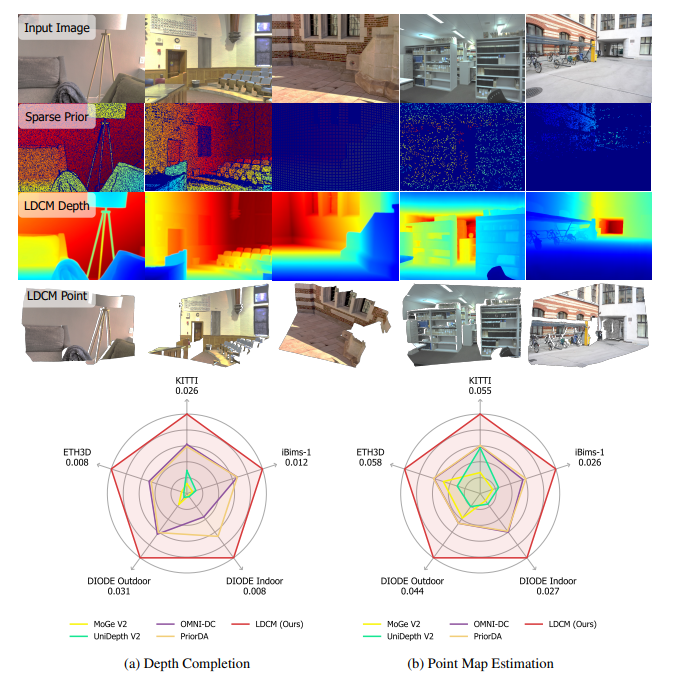

# LDCM: Large Depth Completion Model from Sparse Observations

## 📝 Introduction
**LDCM** is a high-performance depth completion framework. It effectively reconstructs high-fidelity **dense metric depth maps** from a single RGB image and sparse depth measurements.

---

## 🛠 Roadmap
- [ ] Release project paper and technical details.
- [ ] Release pre-trained models.
- [ ] Release training and evaluation scripts.
- [ ] Support for spatio-temporal video depth completion.